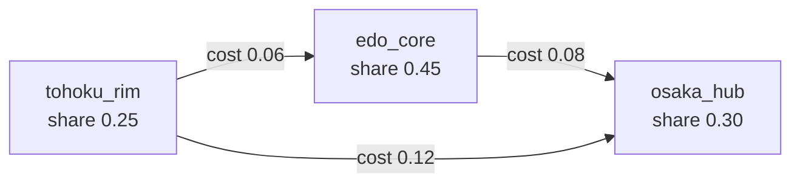

# 農・物流の三角

ノードは建国カタログと同じ 3 地点（`src/mediators.py` の `AREA_IDS`）。シェア合計 1.0。

| ノード | 意味 | 収穫・在庫シェア |
|--------|------|------------------|
| `tohoku_rim` | 東北縁 | 0.25 |
| `edo_core` | 江戸核心 | 0.45 |
| `osaka_hub` | 大坂・畿内 | 0.30 |

基幹輸送コスト `BASE_TRANSPORT`（小さいほど安い）:

```
tohoku_rim ←0.06→ edo_core ←0.08→ osaka_hub
tohoku_rim ←──────── 0.12 ────────→ osaka_hub
```



インフラ損傷 `infraDamage` は辺のコストに加算され、到着量も削る。月次の上限はおおよそ `MAX_TRANSFER_RATIO`（0.15）× 商人の ship。検索語: gravity model, arbitrage, capacity constraint.

## 12 エージェント（地区 × 役割）

ペルソナ CSV: `data/agents/agri_roles.csv`。役割 `farmer` / `merchant` / `warehouse` / `miller`。`--llm` 時は **毎月・全員** を crowd モデルが呼び、失敗なら `dryRunRoleIntent`。

LLM が出してよいのはだいたい:

- `effort` … `[0.35, 1.45]` にクリップ
- `blackMarketLeak` … `[0, 1]`
- `stance` / `rumor` … ログ用

数式側（`runAgricultureAndLogistics`）:

- farmer → 局所収穫 × `(1 - landPollution)`
- warehouse → 腐敗 `stockSpoilage / warehouseCare`
- merchant → 輸送量
- miller → 全国の `processBeansRatio` への小さな nudge
- leak 平均 → `applyAgriLeaks` で食糧・砂糖を薄く抜く

ルートの月次上書きは `data/agents/logistics_routes.csv` と農暦 `data/agents/crop_calendar.csv`。

## 収穫の置き換え

全国 `simulateMonth` が先に米を足したあと、地区ごとに汚染込みの局所収穫で **差し替え** する。そのあと需給ギャップ（シェア正規化した在庫）を見て裁定輸送する。LLM は在庫合計を直接書き換えない。
