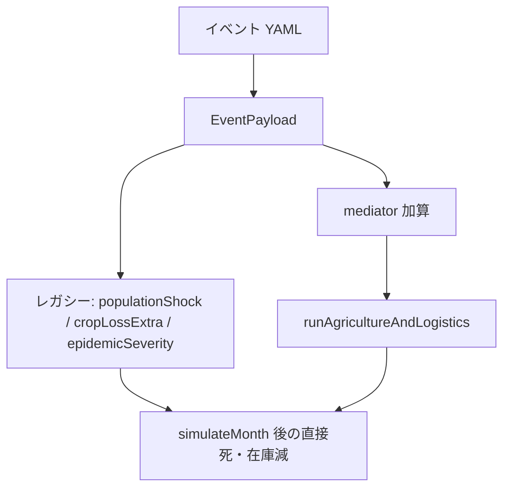

# メディエータ（中間ショック）

イベント YAML が毎回 `population` を直接叩くと、飢饉が二重計上になりやすい。先に **地区ノードと全国バッファ** へ載せ、減衰させてから収穫・輸送・信頼に効かせる。レガシーの直撃も残っている。

検索語: mediator, decaying state, stock-flow, dual path.

## 状態

`ensureMediators` / `decayMediators`（`src/mediators.py`）。チェックポイント `meta` に残る。

**地区**（`tohoku_rim` / `edo_core` / `osaka_hub`）:

- `landPollution` … 収穫を削る
- `infraDamage` … 輸送コスト増・到着ロス
- `riceStock` … シェア付き米在庫

**全国**:

- `laborDrain` … 収穫ファクター減
- `socialUnrest` … 農エージェントの leak / 群衆 hoarding への加算
- `fiatTrust` … 1.0 基準、ショックで低下、減衰で戻る
- `stockSpoilage` / `govDemand` / `importCostShock` / `exportDrain` … **その月だけ**（減衰でゼロに戻す）

減衰: 比率項は × `RATIO_DECAY`（0.6）。汚染・インフラは − `CONST_RECOVERY`（0.1）。信頼は基準へ指数的に戻す。クリップは `[0, 1]`。

## YAML → メディエータ

`applyEventPayloads`。フィールド例: `landPollution`, `infraDamage`, `laborDrain`, `socialUnrest`, `stockSpoilage`, `govDemand`, `importCostShock`, `exportDrain`, `fiatTrustShock`, `targetArea`。

未記入の物理災害（噴火・地震・洪水などのマーカー）は `disasterOverride` から汚染・インフラを **推定補完** する。`worldEffect` が `oil_spike` 等なら輸入コストを足す。`targetArea` が空ならイベント ID から東北 / 江戸 / 西国を当てる。

政策 kit も小さなショックを同じバッファへ載せる（[`POLICY_KIT.md`](POLICY_KIT.md)）。

## レガシー直撃（まだある）

月次エンジンはメディエータのあと、ペイロードの `populationShock` と疫病の合成を人口に、`cropLossExtra` を在庫に（spoil が既に乗っている月は米ロスをスキップ）、`worldEffect`（砂糖・金流出・ハイパー等）をストックに当てる。**二重経路**なので、新しいイベントはメディエータ欄を優先し、直撃は小さく、が安全。
