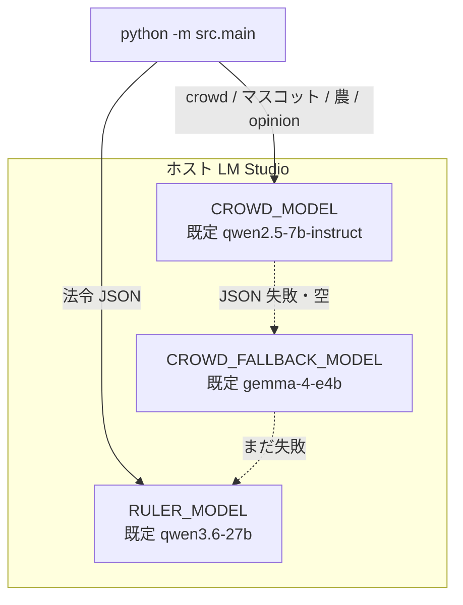

# モデル配線（LLM 推論）

月次ループは **学習しない**。ホストの LM Studio に HTTP で JSON を取りに行く。重みは Git に入れない。ID・ダウンロードは [`MODELS.md`](../MODELS.md)。

検索語: inference, VRAM, context window, JSON schema, fallback chain.

## 誰がどのモデルか

チェーンは `crowdModelChain()`（`src/llm_client.py`）: crowd → fallback → ruler。  
**統治 27B と別の 27B 級を同時 Load すると `terminated` / 空応答になりやすい。** crowd は 7B を推奨。fallback の Gemma は常時 Load しない。

| 呼び出し | 環境変数の目安 | トークン上限の例 |
|----------|----------------|------------------|
| `callRuler` | `RULER_MODEL` | `LM_MAX_TOKENS`（既定 512） |
| `callCrowd` | `CROWD_MODEL` | `LM_CROWD_MAX_TOKENS`（768） |
| `callOpinionLeader` | 同じ crowd | `LM_OPINION_MAX_TOKENS`（384） |
| `callAgriAgent` | 同じ crowd | crowd 側 |
| 人生レカプ | crowd | `LM_RECAP_MAX_TOKENS` |

任意: `LM_USE_JSON_SCHEMA=1`（サーバが schema を拒否したらプレーン chat）。リトライ `LM_CHAT_RETRIES`。ポート `LM_STUDIO_PORT`（既定 1234）。

## オフのとき

`--no-llm` は HTTP を飛ばず dry-run。`--no-agri-llm` は農だけルール。`--historical-policy` は統治者を呼ばず史実表（crowd / 農は別フラグ）。

コンテナからは `host.docker.internal`。プローブ: `python -m src.main --probe`。ローカル GGUF ヒントは `ZUNDA_AI_DIR`（`/models`）。**重みは再配布しない。**
