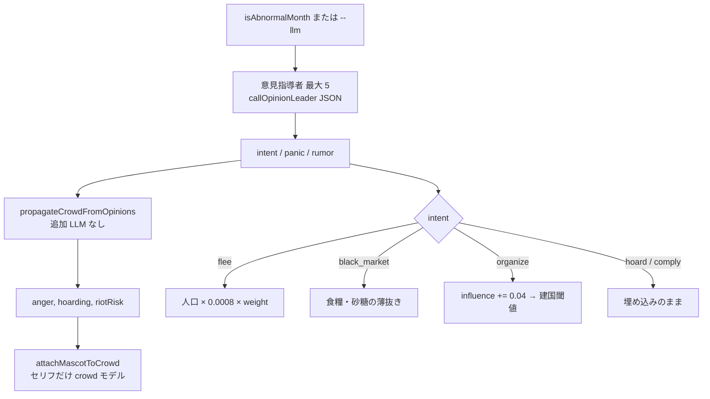

# オピニオンの二段ロケット

異常月（または `--llm`）だけ、固定ロースターの指導者が先に動く。群衆の数値は **伝播式** で、指導者のあとマスコットが口調だけ足す。

検索語: opinion dynamics, cascade, two-stage, threshold model。建国の閾値表は [`FOUNDING.md`](../FOUNDING.md)。

## 段

weight ≈ `influence * (0.5 + 0.5 * panic)`。実装: `src/opinion_agents.py`。

## ロースターとホーム

| agentId | 役割のイメージ | ホーム地域 |
|---------|----------------|------------|
| elder_village | 村の長老 | edo_core |
| merchant_traveler | 行商人 | osaka_hub |
| cult_preacher | 教祖 | edo_core |
| smuggler_broker | 闇市 | osaka_hub |
| frontier_settler | 辺境百姓 | tohoku_rim |

他地域ホームの influence は建国判定で `HOME_FOUNDING_AWAY_WEIGHT`（0.55）倍。平和月は `PEACE_INFLUENCE_DECAY`（0.92）。

## 群衆式（伝播）

リーダーの panic 平均・最大から:

\[
\text{anger} \approx \mathrm{clip}(\text{base}(\text{food}) + 0.6\,\overline{p} + 0.2\,p_{\max})
\]

\[
\text{hoarding} \approx \mathrm{clip}(0.15 + 0.7\,\overline{p})
\]

\[
\text{riotRisk} \approx \mathrm{clip}(0.5\,\overline{p} + 0.2(1-\text{legitimacy}))
\]

通常月（opinion オフ）は crowd モデルが anger / hoarding 自体を出す。異常月パスでは数値は伝播、マスコットだけ生成。
