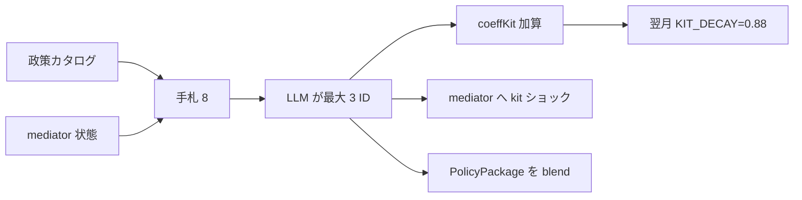

# 政策カードと coeffKit

法令カタログを毎月全部タイムラインに積まない。**手札（action space）** から最大 3 枚だけ有効化し、効果は減衰バッファ `coeffKit` に積む。

検索語: action space, clipping, exponential decay, statute vs shock.

## 手札

`dealPolicyHand`（`src/policy_items.py`）:

1. その月の史実寄り政策を最大 3 枚
2. メディエータから `inferNeed`（例: インフラ傷 → logistics）
3. kit プールから埋めて **8 枚**（`HAND_SIZE`）

統治者 LLM は手札 ID を `activatedPolicyIds` に書く。`clampActivatedIds` が **最大 3**（`MAX_ACTIVATE`）。カタログ外と、手札に無い `statute_*` は落とす。

## kit クラス

タイトル等のマーカーで分類（`inflateBrake` / `growth` / `agri` / `logistics` / `order` / `neutral`）。

| kit | coeffKit に寄りやすい項（例） |
|-----|-------------------------------|
| inflateBrake | mintBrake, priceDamp, trustRepair（収穫はわずかにマイナス） |
| growth | harvestBoost, transferBoost, mintBrake 減 |
| agri | harvestBoost, spoilCut |
| logistics | transferBoost |
| order | priceDamp, trustRepair |
| neutral | trustRepair のみ |

加算後は `KIT_CLAMP`（±0.25）。毎月先に `decayCoeffKit`: 各項 × **0.88**。  
`applyMintBrake` は `reserveMintingRatio` を kit の mintBrake で削る。

政策そのものの連続値は `TWEAK_BLEND`（0.4）で現行パッケージへ寄せる。キット別の一次性ショック（不信・需要・汚染など）はメディエータへ（[`MEDIATORS.md`](MEDIATORS.md)）。
