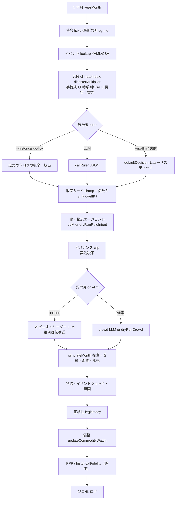

# ルールベースと LLM の境界

このシミュは **状態更新・価格・人口・収量の本体がルールベース** です。  
教師あり学習・強化学習・回帰モデルで価格を予測してはいません。

「機械学習」で検索すると出てくる **LLM（大規模言語モデル / Transformer / 生成AI）** は、**毎月の意図・セリフ・政策 JSON を出す層** にだけ乗っています。出てきた数値は **クランプ（clip）とフォールバック** でエンジンに入ります。失敗や `--no-llm` なら同じ式の dry-run が代わります。

外部 CSV（気候、米収量の逆数インデックス）は学習ではなく **ルックアップ（lookup table）** です。

```
[データ・イベント YAML/CSV] ──┐
                                 │  決定論的（deterministic）
[気候・収量・在庫・税・価格の式] ─┼──► マクロ状態 S_{t+1}
                                 │
[LLM または dry-run] ── 意図・税率・hoarding・セリフ ─┘
         ▲
         └── JSON schema / クリップ / llm_fallback
```

入口: `src/monthly_engine.py` の `runMonthlySimulation`。経済コア: `src/economy.py` の `simulateMonth`。価格: `src/commodity_watch.py`。LLM クライアント: `src/llm_client.py`。

---

## 1ターン（1ヶ月）



**価格とマクロは LLM の後**に決まります。LLM が直接 `zundaPrice` を書くことはありません。間接経路は次です。

- 統治者 → `taxRate`, `processBeansRatio`, `reserveRelease` など
- 群衆 → `hoarding`, `anger`（消費・正統性）
- 農エージェント → `effort`, `blackMarketLeak`, ルート費用

---

## 層の分類

| 層 | 何をしているか | 方式 | 検索語 |
|----|----------------|------|--------|
| イベント発火 | その月の ID を YAML/CSV から取る | ルール + データ | event calendar, lookup |
| 気候 | 季節項 + 飢饉年代 + CSV ブレンド | ヒューリスティック ∪ 観測時系列 | time series, gap filling |
| 収量 | `baseYield × climate × disaster` | 決定論的式 | production function |
| 米インデックス | Figshare 収量の **逆数** を scarcity に | データ駆動・非学習 | inverse yield, proxy |
| 統治者 | 法令・政策 JSON | **LLM** または heuristic / 史実表 | agent-based, JSON schema |
| 政策カード | 手札から ID を選び係数キットへ | カタログ + clamp | action space, clipping |
| ガバナンス | 税率クリップ、遵法、執行効率 | ルール | effective tax rate |
| 農・物流エージェント | effort / leak / rumor | **LLM**（`--llm` 時は毎月）または線形ヒューリスティック | multi-agent |
| 群衆・マスコット | anger, hoarding, セリフ | **LLM** または dry-run。opinion 時はリーダーだけ LLM | opinion dynamics |
| 経済コア `simulateMonth` | 収穫・加工・腐敗・税・消費・餓死 | 在庫会計 | stock-flow, subsistence |
| 価格 `commodity_watch` | 希少性×気候×買いだめ×イベント | 明示式（市場均衡ソルバーではない） | scarcity pricing, reduced form |
| 建国 founding | 影響度が閾値超えで Historical→Simulated | 閾値ルール | regime switch |
| fidelity / PPP | アンカーとの誤差、現代円換算 | **事後評価** | scoring, purchasing power |
| 異常月検出 | 人口・食糧・価格の相対変化 | パーセンタイル閾値 | anomaly detection |

---

## 式（エンジン側）

定数の実体は `src/economy.py` / `src/commodity_watch.py` / `src/governance.py` / `src/historical_track.py`。

### 気候・収量

手続気候の骨格:

\[
\text{climateIndex}^{\text{proc}} = \text{season}(\text{month}) + \text{centuryShocks}(\text{year})
\]

\[
\text{disaster}^{\text{proc}} = \mathrm{clip}\bigl(1 + \min(\text{climateIndex}^{\text{proc}}, 0),\; 0.2,\; 1.0\bigr)
\]

イベントの `disasterOverride` があると **より小さい（厳しい）方** を取ります。CSV がある月は `blendClimate` で混ぜます。

収量（`cropYield`）:

\[
\text{climateBoost} = 1 + c\cdot s_{\text{clim}} + \mathbf{1}_{c<0}\, c\cdot p_{\text{cold}}
\]

\[
Y = \max\bigl( Y_0 \cdot d \cdot \max(\text{climateBoost},\; Y_{\min}),\; 0 \bigr)
\]

\(c=\) `climateIndex`、\(d=\) `disasterMultiplier`。米は収穫月だけ加算。

### 実効税率

\[
\tau_{\text{eff}} = \tau_{\text{nominal}} \cdot \text{compliance} \cdot \text{enforcement} \cdot (1-\text{corruption}) \cdot \text{bureaucracy}
\]

名目税率 \(\tau\) は LLM（または史実表）が出しますが、**上限は時代 epoch のルールで clip** されます。

### 消費・餓死

\[
\text{consumption} = N \cdot \bar{c} \cdot (1 + 0.3\, h)
\]

\(h=\) crowd の `hoarding`。`foodBuffer < 0` なら不足分から死亡を出し、人口フロアで止めます。

### 価格（`updateCommodityWatch`）

例：米（reduced-form の希少性価格。需給交差のソルバーではない）。

\[
P_{\text{rice}} = 1 \cdot \text{climateStress} \cdot (1+0.25 h) \cdot B_{\text{event}}
\cdot \bigl(\max(R/R_{\text{ref}}, 0.3)\bigr)^{-0.15}
\cdot \bigl(\max(H_r/200+0.5, 0.5)\bigr)^{-0.12}
\]

ずんだは加工在庫・枝豆在庫・今期収穫の逆数（べき乗）× 砂糖不足 × 気候 × 買いだめ × イベントバンプ。あんこは砂糖感応が強い（`sugarFactor ** 1.2`）。

### 正統性

餓死率・高税×低食糧・備蓄放出・`anger` の加減算のあと \([0.05, 1]\) にクリップ。  
`--historical-policy` のときは史実ターゲットへキャッチアップが追加されます。

### 歴史フィデリティ（評価指標）

\[
E = 0.35\,|\log(r_{\text{sim}}/r_{\text{tgt}})| + 0.25\,e_{\text{金銀}} + 0.2\,e_{\text{正統}} + 0.2\,e_{\text{人口}}
\]

\[
\text{score} = \max(0,\; 1-E)
\]

シミュを学習しているのではなく、**アンカー系列との距離**です。

---

## LLM が触るもの / 触らないもの

```
触る（ソフト制御）          触らない（ハード状態）
─────────────────          ────────────────────
decree 文面                 population の直接指定
taxRate（その後 clip）      ricePrice の直接指定
processBeansRatio           climateIndex の捏造
hoarding / anger            イベントの有無（カレンダーが先）
effort / blackMarketLeak    収穫月カレンダー
mascotSpeech                fidelity の計算式
opinion の intent           PPP バスケット
```

LLM 呼び出しは **推論（inference）** です。月次ループに重み更新（backpropagation / fine-tune）はありません。聖書（`data/restricted/`、非公開）をプロンプトに載せるのはコンテキスト注入で、必須のベクトルDBはありません。失敗時は `llm_fallback:*` で dry-run に戻します。

既定モデル（詳細は [`MODELS.md`](../MODELS.md)）:

| 役割 | 既定 | 頻度 |
|------|------|------|
| ruler | Qwen 3.6 27B 級 | 毎月（`--llm` かつ非 `--historical-policy`） |
| crowd / マスコット / 農 | Qwen 2.5 7B（失敗時 Gemma など） | `--llm` なら農は毎月・地区×役割 |
| opinion | crowd 系 | 異常月、または `--llm` 時 |

`--historical-policy` かつ金属系本位では統治者を呼ばず史実表。`--no-agri-llm` なら農だけルールのまま統治者 LLM を残せます。

---

## `--no-llm`（validate-baseline）

残る: イベント、気候、収量、在庫会計、価格式、fidelity、PPP、異常月の数値検出、`--historical-policy` のキャッチアップ。

消える（置換される）: 統治者・crowd・農の生成テキストと LLM 由来の連続値。代わりに `defaultDecision` / `dryRunCrowd` / `dryRunRoleIntent`。異常月なら opinion はルール経路でも立ち上がり得ます（`isAbnormalMonth`）。

LLM オフでも経済は止まりません。**ナレーションとソフト制御がヒューリスティックになる**だけです。

---

## 「機械学習」との切り分け

| 見かけ | 実態 |
|--------|------|
| 気候 CSV・米収量逆数 | 観測データのインデックス化。勾配降下なし |
| anomaly のパーセンタイル | ラン内統計の閾値。分類器なし |
| LLM | 事前学習済み生成モデルの API 推論 |
| エージェント | LLM + クリップ付きマルチエージェント・シミュレーション |
| 価格 | 明示的な reduced-form。ARIMA / LSTM ではない |

古典的な **agent-based model (ABM)** に、一部エージェントの方策を LLM にした、という読み方が近いです。

関連する図表: [`INTERNALS.md`](INTERNALS.md)（農・物流、政策 kit、オピニオン、メディエータ、モデル配線）。
